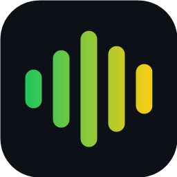

<p align="center">
  
</p>

<h1 align="center">Diz Aí</h1>

<p align="center"><strong>Faça prompts com a sua voz.</strong><br>
Fale do seu jeito. O Claude escreve do jeito certo. O prompt chega pronto no chat.</p>

<p align="center">
  <a href="https://github.com/rodrigogadita/diz-ai/releases/latest"></a>
  <a href="https://github.com/rodrigogadita/diz-ai/actions"></a>
  
  <a href="LICENSE"></a>
</p>

---

Você fala **3 a 4 vezes mais rápido** do que digita. Só que a fala sai cheia de "é", "tipo", "né", correção no meio e nome técnico errado, e prompt ruim vira resposta ruim.

O **Diz Aí** fecha essa conta. Você fala solto, e ele entrega um prompt limpo, organizado e fiel ao que você pediu, direto na caixa do **Claude Code**, do **Copilot** ou do seu terminal.

**Você fala** (com `src/api/rotas.py` aberto e um erro na linha 42):

> é então eu queria que você corrigisse esse erro aqui no arquivo né e aproveita e cria uma função get pedidos por loja no src barra services barra pedidos ponto py que recebe o id da loja e a data e devolve em jeison, não na verdade devolve uma lista de dicionários, e usa o pai test pra testar

**Chega no Claude Code:**

```markdown
**Objetivo**
Corrigir um erro em `src/api/rotas.py` e criar uma nova função de consulta de pedidos por loja.

**O que fazer**
1. Corrija o erro na linha 42 de `src/api/rotas.py`: `"pedido_id" is not defined`.
2. Crie a função `get_pedidos_por_loja` em `src/services/pedidos.py`. Ela recebe o id da loja e a data e devolve uma lista de dicionários.
3. Escreva os testes da função com pytest.

Antes de começar, pergunte se a data deve filtrar um dia exato ou um período a partir dela.
```

*Saída real do lapidador (Sonnet), sem edição.*

## Por que é diferente

| | Ditado comum | **Diz Aí** |
|---|---|---|
| Tira "é", "tipo", "né", hesitação e repetição | ❌ | ✅ |
| Entende "não, na verdade…" e fica com a versão final | ❌ | ✅ |
| "pai tom", "jeison", "cloud code" → Python, JSON, Claude Code | ❌ | ✅ com glossário seu |
| "src barra app ponto py" → `src/app.py` | ❌ | ✅ |
| Sabe o que é "esse arquivo", "esse erro", "essa seleção" | ❌ | ✅ lê o editor |
| Organiza em Objetivo, O que fazer, Restrições, Pronto quando | ❌ | ✅ só com o que você falou |
| Envia por voz ("pode enviar", "manda ver") | ❌ | ✅ |
| Ajusta o prompt por voz ("deixa mais curto") | ❌ | ✅ |
| Histórico com reenvio em um clique | ❌ | ✅ |
| Ondas da voz ao vivo e "ouvindo" confirmado pelo Windows | ❌ | ✅ |
| Detecta microfone no mudo e libera com um clique | ❌ | ✅ |

**Fiel, não criativo.** O lapidador é proibido de inventar requisito, etapa, tecnologia ou teste que você não pediu. Se faltar algo essencial, ele fecha o prompt pedindo que o assistente pergunte antes de sair fazendo.

## Instalação

1. Baixe o `.vsix` da [última versão](https://github.com/rodrigogadita/diz-ai/releases/latest).
2. Instale:
   ```
   code --install-extension diz-ai-1.2.0.vsix
   ```
   Ou, no VS Code, abra **Extensões > ⋯ > Instalar do VSIX**.
3. Tenha a extensão [Claude Code](https://marketplace.visualstudio.com/items?itemName=anthropic.claude-code) instalada e logada. O Diz Aí usa o mesmo login para lapidar. **Não precisa de chave de API.**

Na primeira abertura, o passo a passo **Primeiros passos** aparece sozinho.

## Como usar

| Atalho | O que faz |
|---|---|
| `Ctrl+Alt+D` | Abre o painel **Ao vivo** e liga o microfone. De novo para parar. |
| *(pausa)* | O prompt é escrito **ao vivo** na caixa 2, em streaming. |
| `Ctrl+Alt+Enter` | Envia. Ou só termine a fala com **"pode enviar"**. |
| `Ctrl+Alt+R` | Ajusta o prompt por voz: *"deixa mais curto"*, *"acrescenta que é FastAPI"*. |
| `Ctrl+Alt+L` | Força uma lapidação. |
| `Ctrl+Alt+M` | Dita direto na caixa do chat, sem lapidar. |
| `Esc` | Cancela gravação ou lapidação. |

O ícone **Diz Aí** na barra de status abre o menu com tudo.

### Onde cada coisa aparece

| O quê | Onde |
|---|---|
| **Ondas da sua voz** | No painel **Ao vivo** e na barra de status (`▂▄▆█▆▄ Ouvindo`) |
| **O que você disse** | Caixa **1** do painel **Ao vivo** (pode digitar e corrigir) |
| **O prompt nascendo** | Caixa **2** do painel **Ao vivo**, em streaming (pode editar) |
| **Recomeçar do zero** | Botão **Limpar**: caixas vazias e conversa nova no Claude Code |
| **Tudo junto** | Painel **Ao vivo**, no ícone do Diz Aí na barra lateral: estado, ondas, fala, prompt e os botões Enviar, Ajustar, Copiar e Modo |
| **O que já foi** | **Histórico**, logo abaixo do painel Ao vivo |

Nenhuma aba é aberta: o Diz Aí salva `fala.md` e `prompt.md` em segundo plano, para o Histórico. Prefere abas? Ligue `dizAi.abrirArquivos`.

"Ouvindo" só aparece quando o Windows confirma que o ditado está escutando. Se ele não abrir em 6 segundos, o Diz Aí avisa.

### Não está te ouvindo?

Rode **Diz Aí: testar o microfone** (ou o botão no painel Ao vivo). Ele mede o sinal por 3 segundos, confere se o microfone está no mudo e se o reconhecimento de fala online está ligado, e oferece **Liberar tudo**. O Diz Aí também faz essa checagem sozinho antes de cada ditado.

Causas mais comuns: tecla de microfone do notebook no mudo, reconhecimento de fala online desligado e cursor fora de um campo de texto. O log fica em **Saída > Diz Aí**.

## Modos de escrita

Troque no menu ou no botão do editor. Se o prompt já existe, ele é relapidado no modo novo.

| Modo | Para quê |
|---|---|
| **Prompt estruturado** *(padrão)* | Parágrafo se o pedido for simples; seções se tiver várias partes |
| **Texto limpo** | Só limpa e corrige, na ordem em que você falou |
| **Relato de bug** | O que acontece, o esperado, como reproduzir, onde, o que já tentou |
| **Nova funcionalidade** | Objetivo, comportamento, regras, fora do escopo, pronto quando |
| **Refatoração** | O que mudar, por quê, o que não pode quebrar, como validar |
| **Revisão de código** | O que revisar e com que foco; achados por gravidade |
| **Pergunta** | Uma pergunta direta com o contexto necessário |

Crie os seus:

```jsonc
"dizAi.modosPersonalizados": [
  { "id": "tela", "nome": "Tela nova", "instrucoes": "Organize em Tela, Campos, Ações e Regras visuais." }
]
```

Fala em português e quer o prompt em inglês? `"dizAi.idiomaDoPrompt": "en"`.

## Motores de voz

| Motor | Precisão pt-BR | Custo | Destaque |
|---|---|---|---|
| **Windows (Win+H)** *(padrão)* | Muito boa | Grátis | Nada para configurar, pontua sozinho |
| **Whisper** | Excelente, principalmente com termos técnicos | Groq tem cota grátis; OpenAI pago; local grátis | Usa o seu glossário para acertar nomes; filtra frases que o Whisper inventa no silêncio ("Legendas pela comunidade Amara.org") |
| **VS Code Speech** | Boa | Grátis | 100% offline |

Para o Whisper: **Diz Aí: trocar o motor de voz** e depois **Whisper**. A chave fica no cofre do VS Code, nunca em arquivo. Funciona com qualquer servidor compatível com `/v1/audio/transcriptions` (faster-whisper, speaches, LocalAI).

> **Windows (Win+H):** ligue a *pontuação automática* em **Configurações > Hora e idioma > Digitação > Digitação por voz** e o *reconhecimento de fala online* em **Privacidade > Fala**.

## Destinos

`dizAi.destino` escolhe para onde o prompt vai:

- `auto` *(padrão)*: Claude Code se estiver instalado; senão o chat do VS Code; senão a área de transferência.
- `claude`: caixa da extensão Claude Code (foca e cola).
- `chat`: chat do VS Code (GitHub Copilot e outros).
- `terminal`: Claude Code CLI, Aider, Codex… (cola sem apertar Enter).
- `area`: só copia.

Você sempre revisa antes de apertar Enter.

## Deixe com a sua cara

```jsonc
// Nomes que a voz erra: vão para o Whisper e para o lapidador
"dizAi.glossario": ["Claude Code", "FastAPI", "Supabase", "Kubernetes", "Nome da Sua Empresa"],

// Frase falada → texto fixo
"dizAi.atalhosDeVoz": {
  "regra de testes": "Rode os testes e mostre a saída antes de dizer que terminou."
},

// Frases que enviam o prompt quando ditas no FIM da fala
"dizAi.comandosEnviar": ["pode enviar", "manda ver", "manda bala", "envia aí"],

// Preferências fixas do lapidador
"dizAi.instrucoesExtras": "Sempre peça commits pequenos, em português."
```

## Contexto do editor

O lapidador vê o arquivo em foco, a seleção, os erros do arquivo e a branch (`dizAi.contexto`). Isso **só entra no prompt quando você se refere a eles** ("esse arquivo", "esse erro", "aqui"). O código selecionado serve para ele entender e nunca é copiado para o prompt.

## Privacidade

- **Áudio:** vai para quem transcreve. É o serviço de fala da Microsoft no Win+H, o provedor do Whisper que você escolher, ou fica na sua máquina (VS Code Speech ou Whisper local).
- **Texto:** vai para a Anthropic pela sua própria sessão do Claude Code, para lapidar.
- **Nada mais sai:** sem telemetria e sem servidor do Diz Aí. Os blocos ficam em `Documentos/Diz Aí`, em Markdown, na sua máquina.

## Limites conhecidos

- Nenhuma extensão consegue digitar direto no chat do Claude Code. O Diz Aí foca a caixa e cola. Se a colagem cair num arquivo, ele desfaz sozinho e pede o `Ctrl+V`.
- O Win+H e a gravação do Whisper usam APIs do Windows. No macOS e no Linux, use o VS Code Speech.
- A lapidação depende da extensão Claude Code (ou do `claude` no PATH).

## Desenvolvimento

```bash
git clone https://github.com/rodrigogadita/diz-ai && cd diz-ai
npm test                 # testes das partes puras (texto, prompts)
npm run package          # gera o .vsix
```

Código em JavaScript puro, sem dependências em tempo de execução:

```
src/
  extension.js        orquestra comandos, lapidação ao vivo e comandos de voz
  prompts.js          regras do lapidador e modos (puro)
  texto.js            normalização, comandos de voz, atalhos, alucinações (puro)
  lapidador.js        Claude Code CLI em streaming
  motores/            Windows (Win+H + gravação MCI), Whisper, VS Code Speech
  destinos.js         Claude Code, chat do VS Code, terminal, área de transferência
  blocos.js           fala.md, prompt.md e meta.json de cada ditado
  contexto.js         arquivo, seleção, erros e branch
  historico.js        barra lateral
```

Pull requests são bem-vindos, principalmente de novos modos e melhorias no português.

---

### English

**Diz Aí** ("say it") turns messy spoken ideas into clean, faithful prompts for Claude Code, Copilot Chat or any terminal agent. You get live refinement, voice commands ("pode enviar" sends it), prompt tweaks by voice, context awareness (current file, selection, errors), writing modes, and Windows dictation, Whisper or offline VS Code Speech as engines. It is tuned for Brazilian Portuguese; set `dizAi.idiomaDoPrompt` to `en` to get English prompts from Portuguese speech. MIT licensed.
